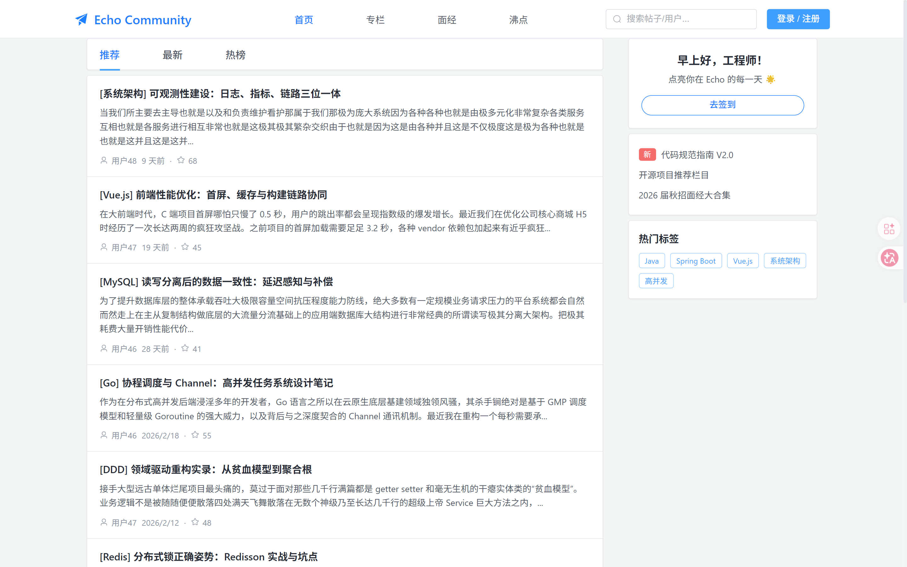
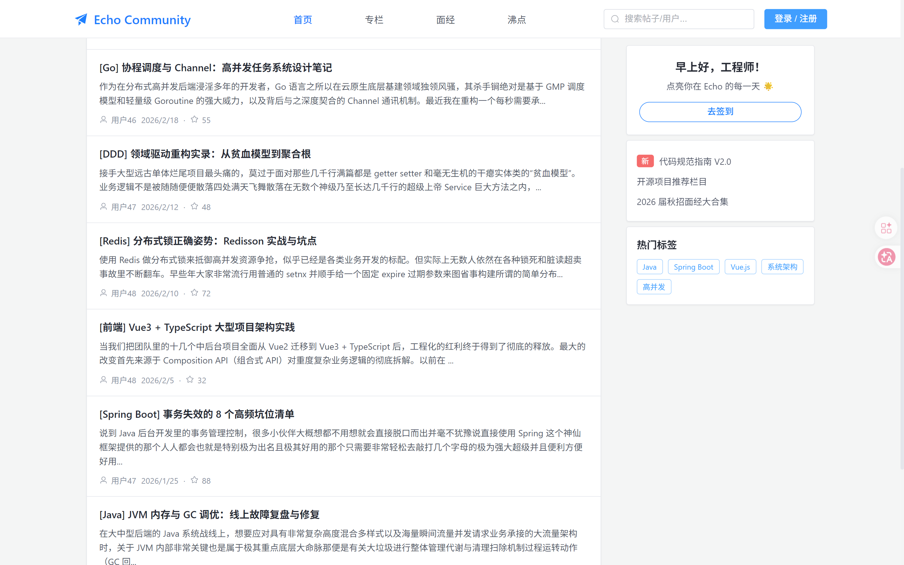
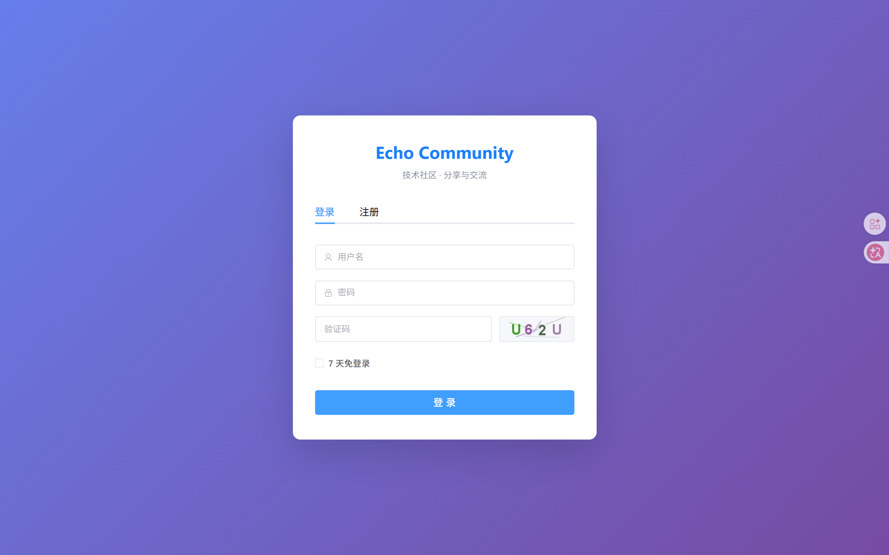

# Echo Community 社区论坛

## 项目简介
Echo Community 是一个全栈社区论坛应用，提供用户认证、发帖、两层评论、点赞关注、私信通知与热度排行能力。

---

## 界面预览

### 系统主页
<div align="center">
  
  <br><b>社区首页 — 帖子推荐 + 侧边栏（签到、热门标签）</b>
</div>

### 内容浏览
<div align="center">
  
  <br><b>更多技术文章列表</b>
</div>

### 用户认证
<div align="center">
  
  <br><b>登录与注册（含验证码）</b>
</div>

---

## 技术栈
> ✅ 2026-04-24 已完成 Spring Boot 2.7.18 → 3.2.0 升级，完整 jakarta 迁移

- Java 17
- Spring Boot 3.2.0
- Spring Security
- MyBatis
- MySQL 8
- Redis
- Quartz
- 前端：Vue 3 + Element Plus

## 模块清单
- [x] 2.1 项目骨架 + 5 张核心表
- [x] 2.2 用户模块 + Spring Security
- [x] 2.3 帖子模块 + 敏感词过滤
- [x] 2.4 评论模块（两层结构）
- [x] 2.5 点赞与关注（Redis）
- [x] 2.6 私信与通知
- [x] 2.7 热度排行 + Quartz
- [x] 2.8 工程质量检查

## 快速启动

### 前端启动
进入 `frontend` 目录：
```bash
cd frontend
pnpm install
pnpm dev
```
👉 **前端首页访问**：`http://localhost:3000`
*(注：项目中已通过 `package.json` 配置 `--open` 参数，执行 `pnpm dev` 后会自动唤起浏览器打开此地址)*

### 后端启动
1. 准备环境：JDK 17、MySQL 8、Redis、Maven 3.8+。
2. 初始化数据库：
   ```bash
   mysql -u root -p < src/main/resources/sql/init.sql
   mysql -u root -p < src/main/resources/sql/security.sql
   ```
3. 配置 `src/main/resources/application.yml`（或环境变量）中的数据库与 Redis 连接。
4. 编译与运行：
   ```bash
   mvn clean compile
   mvn spring-boot:run
   ```
5. 👉 **后端服务地址**：`http://localhost:3002`

## 测试账户

| 用户名 | 密码 | 角色 | 说明 |
|--------|------|------|------|
| `admin` | `admin123` | ADMIN | 管理员账户 |
| `zhangsan` | `zhang123` | USER | 普通用户 |
| `lisi` | `lisi1234` | USER | 普通用户 |

> 种子数据位于 `src/main/resources/sql/seed.sql`，包含 3 个测试用户 + 10 篇技术文章。
> 如需重新初始化，执行：`mysql -u root -p < src/main/resources/sql/seed.sql`

## API 列表
### 认证
- `GET /api/v1/auth/captcha`
- `POST /api/v1/auth/register`
- `POST /api/v1/auth/login`
- `POST /api/v1/auth/logout`

### 帖子
- `POST /api/post`
- `GET /api/post/{id}`
- `GET /api/post/list?sort=time|hot`
- `PUT /api/post/{id}/top`
- `PUT /api/post/{id}/highlight`
- `DELETE /api/post/{id}`

### 评论
- `POST /api/comment`
- `GET /api/comment/list`

### 点赞与关注
- `POST /api/like`
- `POST /api/follow`
- `GET /api/followees`
- `GET /api/followers`

### 私信与通知
- `POST /api/message`
- `GET /api/message`
- `GET /api/notification`

## 返回格式
所有接口统一返回 `Result<T>`：
- `code`：业务状态码（`0` 表示成功）
- `message`：提示信息
- `data`：响应数据
- `timestamp`：服务端时间戳
